<!-- Generated from docs/src/en_US/pages/explained.doc by scripts/yume_docs.py. Edit that file, not this one. -->
# YUME explained

YUME is an independently implemented, embeddable stealth transport. Its own
wire protocols carry application traffic over authenticated carriers shaped
like ordinary web traffic. This page covers the runnable transport-v2 stack,
then the unfinished YTP/1 replacement. [How a byte travels](BYTE_PATH.md) goes
through the layers one at a time, and the [glossary](GLOSSARY.md) defines the
terms.

## The whole picture

YUME is two programs. `yume` runs on your device and collects traffic from your
applications. `yumed` runs on a server you control. Between them the traffic
travels inside one long-lived connection shaped like a browser visiting a
website. The server removes that disguise, applies its policy, makes the real
connection, and returns the answer the same way.

<!-- yume-diagram: yume_connection -->


<details>
<summary>What each part does</summary>

- **YOUR APP**: A program on your device. It reaches the client through SOCKS5, a port forward or packet routing, so it needs no YUME code of its own. ([`src/client/proxy/`](../src/client/proxy), [`src/client/packet/`](../src/client/packet))
- **YUME CLIENT**: Opens a long-lived, browser-shaped connection to your server and carries app connections inside it as numbered streams. ([`src/client/transport/`](../src/client/transport), [`src/client/proxy/socks.cpp`](../src/client/proxy/socks.cpp))
- **FRONT DOOR**: yumed answers like an ordinary website. A tunnel request has to carry a keyed, replay-protected admission token before any YUME authentication begins. ([`src/admission/h2_admission.cpp`](../src/admission/h2_admission.cpp), [`docs/protocol/YUME_2_0_WIRE.md`](protocol/YUME_2_0_WIRE.md))
- **SESSION**: Checks the client's Ed25519 + ML-DSA-87 identity, bound to this TLS connection, seals every message with a one-use AES-256-GCM key, and applies destination policy. ([`src/server/session/auth.cpp`](../src/server/session/auth.cpp), [`src/core/security/session_ratchet.cpp`](../src/core/security/session_ratchet.cpp), [`src/server/session/authorization.cpp`](../src/server/session/authorization.cpp))
- **DESTINATION**: The site or service you asked for. It sees your server's address. yumed also knows the destination, so HTTPS inside the app is what keeps the content private from the server. ([`src/server/session/net.cpp`](../src/server/session/net.cpp))
- **COVER WEBSITE**: A configured website backend on the same port. Ordinary visitors and scanners get its pages. A tunnel request without valid admission never reaches authentication. ([`src/server/runtime/cover_response.cpp`](../src/server/runtime/cover_response.cpp), [`src/server/host/http_backend_client.cpp`](../src/server/host/http_backend_client.cpp))

</details>

<details>
<summary>Text version</summary>

```text
+---------------------------+
|  YOUR APP                 |
|  browser, curl, a game    |
+-------------+-------------+
              |
               \
               v local
 +-------------+-------------+
 |  YUME CLIENT              |
 |  SOCKS5, forward, packets |
 +-------------+-------------+
               |
                \
                v ==YUME==> TLS 1.3 + HTTP/2
  +-------------+-------------+                  +-----------------+
  |  FRONT DOOR               +----------------->|  COVER WEBSITE  |
  |  admission check          |  no valid token  |  ordinary pages |
  +-------------+-------------+                  +-----------------+
                |
                 \
                 v valid token
   +-------------+-------------+
   |  SESSION                  |
   |  AUTH v2, sealed frames   |
   +-------------+-------------+
                 |
                  \
                  v policy-checked egress
    +-------------+-------------+
    |  DESTINATION              |
    |  sees the server's IP     |
    +---------------------------+
```

</details>
<!-- /yume-diagram -->

A visitor without the admission secret sees the cover website and never reaches
YUME authentication. Observers and the server still learn some things, listed
under what stays visible.

## How a connection opens

A connection starts the way a browser's first visit to the cover site would.
The client asks for a tunnel only after that.

<!-- yume-diagram: carrier_open -->


<details>
<summary>What each part does</summary>

- **TLS 1.3 HANDSHAKE**: The client opens TLS 1.3 to yumed with a ClientHello reproduced from one captured browser profile, through an opt-in capability in YUME's pinned OpenSSL build. ([`docs/TRANSPORT_PROFILES.md`](TRANSPORT_PROFILES.md), [`src/core/stealth/tls_client_profile.cpp`](../src/core/stealth/tls_client_profile.cpp), [`patches/`](../patches))
- **PAGE AND ASSETS**: Before any tunnel request, the client loads the captured cover page and its assets on the same HTTP/2 connection, like a first visit to the site. ([`docs/STEALTH.md`](STEALTH.md), [`src/core/stealth/h2_carrier.cpp`](../src/core/stealth/h2_carrier.cpp))
- **TUNNEL REQUEST**: An RFC 8441 extended CONNECT opens a WebSocket stream. Its path carries an admission token: an HMAC over the transport version, the profile, the site name, the hour and a fresh nonce. ([`docs/protocol/YUME_2_0_WIRE.md`](protocol/YUME_2_0_WIRE.md), [`src/admission/h2_admission.cpp`](../src/admission/h2_admission.cpp))
- **ADMISSION CHECK**: yumed recomputes the token for the current or previous hour, checks that the TLS site name and the HTTP/2 authority agree, and records the nonce in a process-wide replay cache of at most 4,096 entries. ([`src/admission/h2_admission.cpp`](../src/admission/h2_admission.cpp), [`docs/STEALTH.md`](STEALTH.md))
- **AUTH V2**: This is the first YUME message. The server's challenge carries fresh public keys, the client proves its Ed25519 + ML-DSA-87 identity, and both sides derive a root key bound to this TLS connection. ([`src/core/security/auth_v2.cpp`](../src/core/security/auth_v2.cpp), [`src/server/session/auth.cpp`](../src/server/session/auth.cpp))
- **SEALED STREAMS**: AUTH_OK arrives already sealed. From then on every message has a one-use AES-256-GCM key and travels as a WebSocket binary message inside HTTP/2 DATA frames. ([`src/core/security/session_ratchet.cpp`](../src/core/security/session_ratchet.cpp), [`src/core/stealth/h2_carrier.cpp`](../src/core/stealth/h2_carrier.cpp))
- **COVER PATH**: Missing, wrong, expired, replayed or mismatched tokens never receive AUTH. The rejected tunnel request gets a bounded 404, which differs from the reference cover server, while page requests still reach the cover site. ([`docs/STEALTH.md`](STEALTH.md), [`src/server/runtime/cover_response.cpp`](../src/server/runtime/cover_response.cpp))

</details>

<details>
<summary>Text version</summary>

```text
+---------------------------+
|  TLS 1.3 HANDSHAKE        |
|  browser-shaped hello     |
+-------------+-------------+
               \
                \
                 v HTTP/2
   +-------------+-------------+
   |  PAGE AND ASSETS          |
   |  ordinary HTTP/2 requests |
   +-------------+-------------+
                  \
                   \
                    v same connection
      +-------------+-------------+
      |  TUNNEL REQUEST           |
      |  extended CONNECT + token |
      +-------------+-------------+
                     \
                      \
                       v path /token/nonce
         +-------------+-------------+           +---------------+
         |  ADMISSION CHECK          +---------->|  COVER PATH   |
         |  HMAC, hour, replay cache |  invalid  |  no AUTH sent |
         +-------------+-------------+           +---------------+
                        \
                         \
                          v valid, unused
            +-------------+-------------+
            |  AUTH V2                  |
            |  identity and root key    |
            +-------------+-------------+
                           \
                            \
                             v AUTH_OK sealed
               +-------------+-------------+
               |  SEALED STREAMS           |
               |  WebSocket messages       |
               +---------------------------+
```

</details>
<!-- /yume-diagram -->

1. The client establishes TLS 1.3 to `yumed`, with certificate and hostname
   checks and the configured trust policy. Its ClientHello follows one
   captured browser profile. `yumed` terminates public TLS and HTTP/2.
2. The client loads the cover page and its assets over HTTP/2. The reference
   cover site runs in a separate loopback process and receives ordinary web
   requests, never tunnel records or credentials.
3. The client requests an RFC 8441 WebSocket carrier whose path carries a
   keyed, replay-protected admission token. HTTP/2 stays active for the whole
   connection.
4. AUTH v2 verifies the composite Ed25519 and ML-DSA-87 client identity and
   binds it to the live TLS exporter. ML-KEM-1024, X25519, and the random file
   PSK contribute to session establishment. An admin session requires a
   separate second identity. The protected `AUTH_OK` arrives only after the
   inner channel is active.
5. YUME frames multiplex application traffic through WebSocket binary messages
   inside HTTP/2 DATA. Independent directional ratchets use one-use
   AES-256-GCM message keys. Stream credit, bounded queues, and backpressure
   control how much work each connection can retain.
6. `yumed` applies destination and authorization policy before opening egress.

The client authenticates the server through TLS trust, optional leaf pinning,
and optional operator proof. The server's client-identity stores do not supply
a server identity to the client. The admission secret and the inner PSK are
separate files and separate gates.

Missing or invalid admission never reaches AUTH. A rejected extended CONNECT
currently receives a bounded synthetic 404, which differs from the reference
Node server's response. Ordinary page requests reach the cover site. YUME emits
no synthetic idle traffic, and encrypted timing, size, and volume remain
observable.

The [transport-v2 wire contract](protocol/YUME_2_0_WIRE.md) owns the exact
framing, admission, key schedule, and remaining profile differences.
[Stealth transport](STEALTH.md) owns what may be claimed about the disguise.

## One byte's trip

1. An application hands the byte to the client through SOCKS5, a port
   forward, packet routing through a TUN device, or the experimental ABI's
   named-stream interface. The destination it asks for travels inside the
   tunnel.
2. The client seals it. After authentication every message is encrypted and
   authenticated with its own AES-256-GCM key, which is erased after use.
3. The client puts an 8-byte YUME frame header in front of the sealed payload,
   with its length, type, stream number, and flags. The stream number lets many
   connections share one tunnel. The seal does not encrypt the header, but it
   authenticates the type, stream number, and flags, so a relabelled or moved
   message fails verification.
4. The framed message becomes a WebSocket binary message on an HTTP/2 stream
   inside TLS 1.3.
5. `yumed` removes the carrier layers, verifies the seal, reads the stream
   number, and hands the bytes to that stream. Admission and AUTH already
   happened when the connection opened.
6. Policy decides whether the stream may reach its destination. The destination
   sees the server's egress address.
7. The reply takes the same path back.

## The wrapping

<!-- yume-diagram: carrier_layers -->


<details>
<summary>What each part does</summary>

- **YOUR BYTES**: Whatever the application sent. If the app already used HTTPS, this part is encrypted by the app itself as well.
- **SEALED**: After authentication every message is sealed with its own AES-256-GCM key from the session ratchet, and that key is erased once used. ([`src/core/security/session_ratchet.cpp`](../src/core/security/session_ratchet.cpp), [`src/core/security/ratchet.cpp`](../src/core/security/ratchet.cpp))
- **YUME FRAME**: An 8-byte header gives the length, frame type, stream number and flags, so many app connections share one tunnel. The seal authenticates the type, stream and flags. ([`src/core/protocol/protocol.hpp`](../src/core/protocol/protocol.hpp), [`docs/protocol/YUME_2_0_WIRE.md`](protocol/YUME_2_0_WIRE.md))
- **WEBSOCKET**: Frames travel as WebSocket binary messages, opened with an RFC 8441 extended CONNECT the way a browser keeps a live channel open. ([`src/core/stealth/h2_carrier.cpp`](../src/core/stealth/h2_carrier.cpp))
- **HTTP/2 STREAM**: The WebSocket lives on one HTTP/2 stream, opened after the client has fetched the cover site's page and assets on the same connection. ([`src/core/stealth/h2_carrier.cpp`](../src/core/stealth/h2_carrier.cpp))
- **TLS 1.3**: Encrypts everything inside it. The handshake follows one captured browser profile. It hides content, not timing, sizes or volume. ([`docs/TRANSPORT_PROFILES.md`](TRANSPORT_PROFILES.md), [`patches/`](../patches))
- **TCP**: What a network observer sees first: a TCP connection to the server's HTTPS port.

</details>

<details>
<summary>Text version</summary>

```text
+-------------------------------------------------------+
| TCP                                    the HTTPS port |
| +---------------------------------------------------+ |
| | TLS 1.3                  captured browser profile | |
| | +-----------------------------------------------+ | |
| | | HTTP/2 STREAM                     DATA frames | | |
| | | +-------------------------------------------+ | | |
| | | | WEBSOCKET                  binary message | | | |
| | | | +---------------------------------------+ | | | |
| | | | | YUME FRAME       length, type, stream | | | | |
| | | | | +-----------------------------------+ | | | | |
| | | | | | SEALED   AES-256-GCM, one-use key | | | | | |
| | | | | | +-------------------------------+ | | | | | |
| | | | | | | YOUR BYTES  what the app sent | | | | | | |
| | | | | | +-------------------------------+ | | | | | |
| | | | | +-----------------------------------+ | | | | |
| | | | +---------------------------------------+ | | | |
| | | +-------------------------------------------+ | | |
| | +-----------------------------------------------+ | |
| +---------------------------------------------------+ |
+-------------------------------------------------------+
```

</details>
<!-- /yume-diagram -->

The seal and the frame header protect and separate the traffic. WebSocket,
HTTP/2, and the shape of the TLS handshake make it look like a web application.
[How a byte travels](BYTE_PATH.md) explains each layer and what a change to it
affects.

## Handshake and keys

After admission the two sides run AUTH v2. The server sends a challenge with
fresh public keys, the client answers with its own key material and proof of
identity, and both derive the same root key from four inputs:

<!-- yume-diagram: session_keys -->


<details>
<summary>What each part does</summary>

- **X25519**: An elliptic-curve Diffie-Hellman exchange. Both sides contribute fresh X25519 keys during AUTH. ([`src/core/security/auth_v2.cpp`](../src/core/security/auth_v2.cpp))
- **ML-KEM-1024**: A NIST post-quantum key encapsulation. The server's challenge carries a fresh ML-KEM-1024 public key and the client's response carries the ciphertext. ([`docs/protocol/YUME_2_0_WIRE.md`](protocol/YUME_2_0_WIRE.md))
- **FILE PSK**: A pre-shared 32-byte random secret, distributed out of band and separate from the admission secret. It passes through HKDF-SHA256 once per connection. ([`docs/protocol/YUME_2_0_WIRE.md`](protocol/YUME_2_0_WIRE.md), [`src/core/security/secret_file.cpp`](../src/core/security/secret_file.cpp))
- **TLS EXPORTER**: A value each end derives from its own finished TLS 1.3 handshake. It is never sent, so a handshake relayed onto a different TLS connection cannot derive the same keys. ([`src/core/security/channel_binding.cpp`](../src/core/security/channel_binding.cpp))
- **ROOT KEY**: One HKDF-SHA256 derivation mixes all four with the transcript salt and the profile label. Breaking X25519 or ML-KEM alone, or stealing only the PSK, does not yield the root key. ([`docs/protocol/YUME_2_0_WIRE.md`](protocol/YUME_2_0_WIRE.md))
- **DIRECTIONAL CHAINS**: Each direction gets its own root and chain under distinct versioned labels, so the two directions never share a key. ([`docs/protocol/YUME_2_0_WIRE.md`](protocol/YUME_2_0_WIRE.md))
- **MESSAGE KEY**: Every message derives its own AES-256-GCM key, uses it once and erases it. The receiver requires the exact expected epoch and sequence. ([`src/core/security/session_ratchet.cpp`](../src/core/security/session_ratchet.cpp), [`src/core/security/ratchet.cpp`](../src/core/security/ratchet.cpp))

</details>

<details>
<summary>Text version</summary>

```text
+------------------------+
|  X25519                +---+
|  classical exchange    |   |
+------------------------+   |
                             |
+------------------------+   |
|  ML-KEM-1024           +---+
|  post-quantum exchange |   |
+------------------------+   |
                             |
+------------------------+   |
|  FILE PSK              +---+
|  32 random bytes       |   |
+------------------------+   |
                             |
+------------------------+   |
|  TLS EXPORTER          +---+
|  this TLS connection   |   |
+------------------------+   |
                             |
                             |
                             v
                +------------+------------+
                |  ROOT KEY               |
                |  HKDF-SHA256            |
                +------------+------------+
                              \
                               \
                                v split
                   +------------+------------+
                   |  DIRECTIONAL CHAINS     |
                   |  one per direction      |
                   +------------+------------+
                                 \
                                  \
                                   v each message
                      +------------+------------+
                      |  MESSAGE KEY            |
                      |  AES-256-GCM, used once |
                      +-------------------------+
```

</details>
<!-- /yume-diagram -->

An identity is a pair of signature keys used together, Ed25519 and ML-DSA-87,
and both signatures must verify. A normal user holds one identity. An
administrator needs a second, distinct identity from a separate admin list.

Each direction moves through epochs. Before an epoch's byte, frame, or time
budget runs out, the sides exchange fresh ML-KEM and X25519 material for the
next one. The [security modes](SECURITY_MODES.md) set those budgets:

| Mode | Epoch budget, whichever comes first | Trade-off |
| --- | --- | --- |
| `extreme` (default) | 256 KiB, 512 frames, or 500 ms | The smallest epochs and the most rekey work |
| `normal` | 8 GiB, 262,144 frames, or 60 s | Less rekey overhead on fast links |
| `soft` | 256 GiB, 8,388,608 frames, or 30 min | Throughput first, with a much wider compromise window |
| `ultimate` | Supplied by the operator | An expert-managed bounded policy |

Preparing more future epochs ahead helps high-latency links and keeps more
future key material in memory.

## Inside the client

<!-- yume-diagram: client_inside -->


<details>
<summary>What each part does</summary>

- **YUME CLI**: The yume command parses flags and the config file, then runs the connected client in its own process. ([`src/main_client.cpp`](../src/main_client.cpp), [`src/client/cli/entry.cpp`](../src/client/cli/entry.cpp))
- **DESKTOP APP**: The optional desktop app drives the client through yume_facade, which adds session objects, a traffic meter and key management on top of yume_embed. ([`src/gui/`](../src/gui), [`src/facade/session/client_session.cpp`](../src/facade/session/client_session.cpp))
- **C ABI**: The opt-in C interface for other programs. It reaches transport v2 only through yume_embed, never the desktop layer, and it is build-tree only and not frozen. ([`src/abi/yume_c.cpp`](../src/abi/yume_c.cpp), [`docs/ABI.md`](ABI.md))
- **CLIENT TRANSPORT**: The transport core owns frame dispatch, write scheduling and flow credit for every stream, whichever entry point started it. ([`src/outbound/core.cpp`](../src/outbound/core.cpp), [`src/client/transport/`](../src/client/transport))
- **TUNNEL POOL**: Holds the authenticated tunnels to yumed. Each new SOCKS session is bound to one live tunnel for its lifetime, so its stream numbers stay on one TLS connection. ([`src/client/transport/tunnel_pool.hpp`](../src/client/transport/tunnel_pool.hpp))

</details>

<details>
<summary>Text version</summary>

```text
+-------------------------+
|  YUME CLI               +---+
|  commands and config    |   |
+-------------------------+   |
                              |
+-------------------------+   |
|  DESKTOP APP            +---+
|  optional GUI           |   |
+-------------------------+   |
                              |
+-------------------------+   |
|  C ABI                  +---+
|  experimental embedding |   |
+-------------------------+   |
                              |
                              |
                              v
                +-------------+------------+
                |  CLIENT TRANSPORT        |
                |  streams, credit, frames |
                +-------------+------------+
                               \
                                \
                                 v frames
                   +-------------+------------+
                   |  TUNNEL POOL             |
                   |  one or more carriers    |
                   +-------------+------------+
                                  \
                                   \
                                    v ==YUME==> TLS 1.3 + HTTP/2
                      +-------------+------------+
                      |  YUMED                   |
                      |  your server             |
                      +--------------------------+
```

</details>
<!-- /yume-diagram -->

| Piece | What it does | Where |
| --- | --- | --- |
| Command line | Parses commands and flags, loads the config, and starts a connected session | `src/client/cli/` |
| Transport core | Frame dispatch, write scheduling, and flow credit | `src/outbound/` |
| Tunnel pool | Authenticated tunnels to `yumed`, each SOCKS session bound to one | `src/client/transport/` |
| Local entry points | SOCKS5 proxy, port forwards, and TUN packet routing | `src/client/proxy/`, `src/client/packet/` |
| Control API | A local socket that queries and steers a running client with JSON | `src/client/runtime/`, [control API](CONTROL_API.md) |
| Embedding | The C ABI and the backend seam it leases | `src/abi/`, `src/facade/session/`, [C ABI](ABI.md) |

## Inside the server

`yumed` has one Manager and many sessions. The Manager loads the configuration
and the key lists, accepts connections, and gives each one a session, which
moves through these stages:

1. Carrier: TLS and HTTP/2, answering like a web server.
2. Admission: the token check. Failures stay on the cover path.
3. AUTH: handshake, identity check, and root key.
4. Open: streams to destinations, relay peers, or reverse forwards, each
   checked against policy.
5. Close: teardown releases the session's resources and secrets.

The authorized-keys file and its metadata sidecar list who may connect, and
operator and admin keys have their own files. The Manager loads them as one
consistent snapshot, so a reload never sees half of an edit.

Dangerous features need every applicable gate to agree. LAN and private-IP
bridging needs a build switch, a server flag, and a per-key `allow_local_ip`
entry, and the server flag never grants it to an identity that did not opt in.
The [permission model](PERMISSIONS.md) lists every gate.

## How work is scheduled

Code starts a network read or write and returns at once, and a handler runs
when the data is ready. Each session's handlers run in order on its own strand,
and a few worker threads share all sessions.

<!-- yume-diagram: session_threads -->


<details>
<summary>What each part does</summary>

- **SESSION**: Each session queues its network and timer handlers on its own strand, so its steps never overlap or run out of order, even with several threads. ([`src/server/session/session.hpp`](../src/server/session/session.hpp))
- **RELAY STREAM**: On the client, each relay stream is serialized on one strand as well. ([`src/client/cli/commands/io_runtime.cpp`](../src/client/cli/commands/io_runtime.cpp))
- **EVENT LOOP**: Sockets and timers complete here. A handler starts a read or write and returns at once, and the loop runs the next handler when data is ready. ([`src/server/cli/entry.cpp`](../src/server/cli/entry.cpp), [`src/core/runtime/worker_loop.hpp`](../src/core/runtime/worker_loop.hpp))
- **WORKER THREADS**: Several threads run the same loop. yumed defaults to the hardware thread count and the client to at most four. A handler exception is contained so one peer cannot abort the process. ([`src/client/cli/commands/io_runtime.cpp`](../src/client/cli/commands/io_runtime.cpp), [`src/core/runtime/worker_loop.hpp`](../src/core/runtime/worker_loop.hpp))

</details>

<details>
<summary>Text version</summary>

```text
+-------------------------+
|  SESSION                +---+
|  handlers on its strand |   |
+-------------------------+   |
                              |
+-------------------------+   |
|  ANOTHER SESSION        +---+
|  its own strand         |   |
+-------------------------+   |
                              |
+-------------------------+   |
|  RELAY STREAM           +---+
|  its own strand         |   |
+-------------------------+   |
                              |
                              |
                              v
                 +------------+-----------+
                 |  EVENT LOOP            |
                 |  one Asio io_context   |
                 +------------+-----------+
                               \
                                \
                                 v run by
                    +------------+-----------+
                    |  WORKER THREADS        |
                    |  run the loop together |
                    +------------------------+
```

</details>
<!-- /yume-diagram -->

A handler can still run after its session has closed.
[How a byte travels](BYTE_PATH.md) explains why that causes crashes and how the
code prevents it.

## Built on the same session

These features reuse the same sessions and keys. Their permission gates are in
the [permission model](PERMISSIONS.md).

| Feature | What it does | Where |
| --- | --- | --- |
| Relay v2 | Chat, files, and byte streams between two YUME users through a server, with their own end-to-end handshake | `src/client/relay/`, `src/server/runtime/manager_relay.cpp` |
| Federation | Direct links between servers, one hop only. Multi-hop transit is design-only | `src/server/federation/` |
| Packet mode | Whole IP packets through a TUN device instead of per-application proxying | `src/client/packet/`, [packet-native bulk mode](PACKET_NATIVE_BULK.md) |
| Reverse forwards | A port on your machine made reachable through the server | `src/server/session/reverse_listener.cpp` |
| Share files | Password-protected `.yss` store files | `src/client/transfer/share_file.cpp` |
| Operator proof | The operator proves control of the operator key. It says nothing about logging | `src/server/cli/anonym.cpp` |
| Filters | Destination filtering and robots rules on the server | `src/server/filter/`, [filtering](FILTERING_SELF_DPI.md) |
| Host controller | Extra listeners and HTTP routes on the server host | [host controller](HOST_CONTROLLER.md) |
| Application codecs | Protocol-aware helpers such as a Monero RPC codec | [application codecs](APP_CODECS.md) |
| Remote commands | Disabled. The wire and policy inputs are reserved, and execution fails closed | [implementation status](IMPLEMENTATION_STATUS.md) |
| Benchmarks and self-test | Built-in checks that grade a setup and measure throughput | [benchmarks](SELFTEST.md), [diagnostics](DIAGNOSTICS.md) |

## What stays visible

| Who | Still sees |
| --- | --- |
| A network observer | The server's IP address, the ClientHello including the site name, and encrypted timing, sizes, duration, and volume |
| The server operator | Authenticated client identities, requested destinations, and any bytes the application did not protect itself |
| The hosting provider | The server's outbound destinations |
| The destination | The server's egress address and the application's own traffic |

YUME cannot help when the server's address is blocked, and the project makes no
undetectability claim. `yumed` is a single-hop proxy that terminates the tunnel.
The [threat model](THREAT_MODEL.md) and [stealth transport](STEALTH.md) own
these limits.

## Where to start reading

Read the tests beside the code before its comments. Tests show verified
behavior.

| Question | Start at |
| --- | --- |
| How does the client start? | `src/main_client.cpp`, then `src/client/cli/entry.cpp` |
| How does the server start? | `src/main_server.cpp`, then `src/server/runtime/manager.cpp` |
| What is on the wire? | [Transport-v2 wire contract](protocol/YUME_2_0_WIRE.md) |
| How are keys made? | `src/core/security/auth_v2.cpp`, `src/core/security/session_ratchet.cpp` |
| How does it look like a browser? | `src/core/stealth/`, [transport profiles](TRANSPORT_PROFILES.md) |
| What may be claimed about stealth? | [Stealth transport](STEALTH.md) |
| What works today? | [Implementation status](IMPLEMENTATION_STATUS.md) |
| Which folder owns what? | [Source map](SOURCE_MAP.md) |
| Which layer may depend on which? | `cmake/YumeLayering.cmake` |

## Two stacks

Transport v2 runs today. YTP/1, YUME Transport Protocol 1, is a replacement
being built beside it. Product, transport, AUTH, ABI, and schema versions are
independent.

| | Transport v2 | YTP/1 |
| --- | --- | --- |
| Status | Runs, is tested, and carries traffic | Unfinished replacement |
| Stream numbers | One byte per frame | 31-bit, odd and even by role |
| Contract | [Wire contract](protocol/YUME_2_0_WIRE.md) | [YTP/1 kernel](protocol/YTP_1.md) |
| Code | `src/core/`, `src/client/`, `src/server/` | `src/ytp/`, `src/engine/`, `src/providers/` |

The replacement's engine and protocol kernel may not use sockets, TLS, HTTP/2,
JSON, or the filesystem. CMake checks that at configure time, so that core can
be tested in isolation.

## The YTP/1 replacement

YTP/1's core abstraction is an authenticated peer opening a named byte stream
or packet channel. `NativeEndpoint` now composes its providers, protected
credentials and service policy into a native client/server connection. An
experimental ABI backend already carries named byte streams over it, but the
standalone adapters remain unfinished and packet operations are unsupported.

### Dependency path

```text
ByteChannel
  -> SecureChannel
  -> Carrier
  -> SessionEngine
  -> StreamDispatcher
  -> StreamHandler or RouteProvider
```

- `ByteChannel` owns reliable ordered asynchronous bytes, cancellation,
  executor affinity, bounded writes, and move-only buffers.
- `SecureChannel` adds an exporter-quality binding plus bounded outer-channel
  evidence, which may represent an unauthenticated TLS client. Only successful
  YTP authentication creates application `PeerEvidence` for policy. TLS 1.3 is
  the required first provider.
- `FrontDoor` owns listening, real website/reverse-proxy traffic, cheap
  replay-protected admission, and promotion to a typed ready carrier that
  retains the admitted HTTP/2 connection, stream, and flow-credit state.
- `Carrier` maps secure plaintext to records and owns outer flow credit. The
  first carrier is duplex HTTP/2.
- `SessionEngine` owns YTP/1 authentication, records, ratchets,
  multiplexing, capabilities, backpressure, and lifecycle without depending on
  sockets, TLS, HTTP/2, JSON, filesystem, CLI, or GUI.
- `StreamHandler` independently authorizes each authenticated named OPEN.
- `RouteProvider` performs explicit egress only after dispatcher policy passes.
  The Asio provider also requires policy for every selected numeric address
  before opening sockets, including DNS answers and mapped IPv6 addresses.

`EngineBuilder` selects exact, instance-local providers and freezes the graph.
There is no global mutable registry, reflection configuration, runtime
`dlopen()`, provider fallback, or YTP/1 suite negotiation.

### Connection path

The intended direct tunnel route is:

```text
application -> SOCKS/ABI adapter -> YUME endpoint -> TLS 1.3 + HTTP/2
            -> authenticated YTP/1 session -> authorized direct route
            -> destination
```

A local adapter asks the endpoint to open the named `tcp`, `udp`, or another
application service. Service identity is the pair `(name, kind)`, allowing one
name to expose distinct stream and packet semantics. YTP/1 assigns a 31-bit
odd/even stream ID, preserves application payload opacity, and applies
connection and stream credit. Direct TCP/UDP destinations use strict built-in
binary encodings rather than JSON.

The server terminates the YUME session and therefore learns the authenticated
client identity, service, and direct destination. HTTPS or another independent
application protocol can still protect content end to end.

### Public front door

The native public listener serves a configured static website. Normal browser
traffic and invalid or missing admission remain in that cover site; reverse
proxy cover is still unimplemented. Only a bounded, replay-protected admission
path can promote a connection to YTP/1. Unauthenticated failures must not
receive a YUME-shaped response.

Browser-shaped geometry is an independently versioned evidence profile. A new
capture does not revise authenticated YTP semantics. Claims must name the exact
qualified profile and environment. YUME does not claim universal
indistinguishability or DPI resistance.

### Session security contract

YTP/1 fixes one mandatory composition and binds it into a canonical schedule:

- Ed25519 **and** ML-DSA-87 authentication
- X25519 and ML-KEM-1024 establishment
- a unique access PSK for each authorized key
- the live TLS exporter
- suite, roles, transcript, both identities, both capability manifests, and
  exact security parameters
- independent directional rekeying and one-use AES-256-GCM keys for protected
  records. The sole bare post-AUTH record is the candidate-new-root
  authenticated rekey acknowledgement defined by YTP/1.

All required components must succeed. A mismatch is terminal, and there is no
downgrade or retry with a weaker provider. Ratcheting is described as
post-compromise-oriented until recovery assumptions have formal and
experimental support.

### Capabilities and policy

AUTH binds a bounded canonical service-capability manifest. Every OPEN is still
checked independently against identity, service kind, destination policy, and
resource limits. Capability advertisement cannot bypass authorization.

Routes are fenced by construction: only the session dispatcher can create an
`AuthorizedRouteRequest`, and it does so after the policy gate. Slow consumers,
stream floods, malformed input, packet batches, control messages, and rekey work
all meet explicit bounds before allocation.

### Embedding

The [C ABI candidate](ABI.md) exposes runtime, immutable configuration,
endpoint, stream, and packet handles through `<yume/yume.h>`. It provides
blocking calls with timeouts over the asynchronous engine. The build-tree
library carries named streams through transport v2, or through
`NativeEndpoint` when every native YTP/1 provider is built. Packet operations
remain unsupported.

Trusted in-process providers use the experimental C++20 SDK. Out-of-process
plugins remain a separate design decision.

### Product boundary

The first complete YTP/1 path targets direct routing, SOCKS5, named-service,
and packet adapters. Native endpoints accept configured direct TCP and UDP
routes under application-supplied policy, but the standalone SOCKS5,
named-service and packet adapters are not wired yet. GUI, direct
single-hop federation, directory, relay applications, reverse administration,
and product-specific codecs remain separate transport-v2 surfaces. Transit is
design-only, and command execution is reserved and disabled. None is a
prerequisite for the first replacement tunnel. Dynamic plugins and
cryptographic suite negotiation are outside YTP/1.

See [implementation status](IMPLEMENTATION_STATUS.md) for the integration gates.
