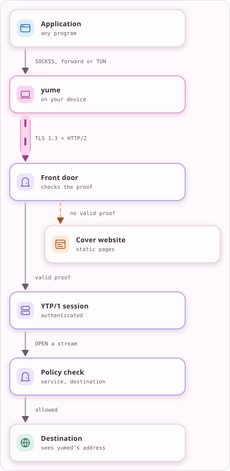
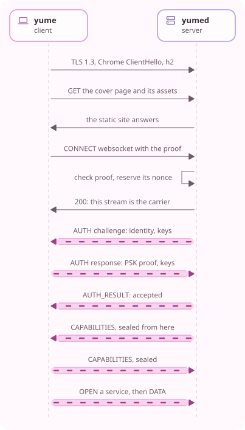
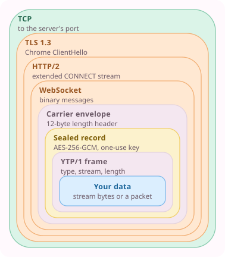

<!-- Generated from docs/src/en_US/pages/explained.doc by scripts/yume_docs.py. Edit that file, not this one. -->
# YUME explained

YUME is two programs. `yume` runs on your device and collects traffic from your
applications. `yumed` runs on a server you control. The traffic travels between
them inside one long-lived connection that looks like a browser visiting a
website. The server authenticates the client, checks what it may reach, makes
the real connection and sends the answer back the same way.

<!-- yume-diagram: traffic_path -->


<details>
<summary>What each part does</summary>

- **yume**: Collects traffic from applications and sends it to the server inside one long-lived connection that looks like a browser visiting a website. ([`src/runtime/native_client_runtime.cpp`](../src/runtime/native_client_runtime.cpp))
- **Front door**: Answers every request without a valid admission proof from the static website, so a scanner sees an ordinary site. ([`src/providers/h2_web_front_door.cpp`](../src/providers/h2_web_front_door.cpp), [`src/providers/ytp1_h2_admission.cpp`](../src/providers/ytp1_h2_admission.cpp))
- **YTP/1 session**: Both identities are proven with Ed25519 and ML-DSA-87, and the session keys mix X25519, ML-KEM-1024, the client's access PSK and the TLS connection. ([`src/engine/session_engine.cpp`](../src/engine/session_engine.cpp), [`src/providers/openssl_security_provider.cpp`](../src/providers/openssl_security_provider.cpp))
- **Policy check**: Each stream names a service. yumed checks that this client may use it and that every address of the destination is allowed before it opens a socket. ([`src/runtime/native_credentials.cpp`](../src/runtime/native_credentials.cpp), [`src/runtime/native_egress_policy.cpp`](../src/runtime/native_egress_policy.cpp))
- **Cover website**: The operator's own static site, loaded when yumed starts. There is no built-in fallback site. ([`src/providers/cover_site.cpp`](../src/providers/cover_site.cpp))

</details>

<details>
<summary>Text version</summary>

```text
+-----------------------+
|  Application          |
|  any program          |
+-----------+-----------+
             \
              \
               v SOCKS5, forward or TUN
   +-----------+-----------+
   |  yume                 |
   |  on your device       |
   +-----------+-----------+
                \
                 \
                  v ==YUME==> TLS 1.3 + HTTP/2
      +-----------+-----------+                  +----------------+
      |  Front door           +----------------->|  Cover website |
      |  checks the proof     |  no valid proof  |  static pages  |
      +-----------+-----------+                  +----------------+
                   \
                    \
                     v valid proof
         +-----------+-----------+
         |  YTP/1 session        |
         |  authenticated        |
         +-----------+-----------+
                      \
                       \
                        v OPEN a stream
            +-----------+-----------+
            |  Policy check         |
            |  service, destination |
            +-----------+-----------+
                         \
                          \
                           v allowed
               +-----------+-----------+
               |  Destination          |
               |  sees yumed's address |
               +-----------------------+
```

</details>
<!-- /yume-diagram -->

This page describes the default programs, which speak YTP/1 (YUME Transport
Protocol 1). The [glossary](GLOSSARY.md) defines the terms, and the
[YTP/1 reference](protocol/YTP_1.md) has the exact wire format.

## Setting up

`yume-setup init` writes a server directory and a client bundle. Each side gets
a composite identity, an Ed25519 key paired with an ML-DSA-87 key. The server
also gets an ML-KEM-1024 key, a TLS certificate and a 32-byte admission key.
Each client gets its own access PSK. The client bundle carries the server's
public keys, so the client knows exactly which server it must reach.
`add-client` issues more bundles for the same server.

## How a connection opens

1. `yume` opens TCP to the server. A server name is looked up in a small
   helper process, so a hung DNS lookup never blocks shutdown.
2. It starts TLS 1.3 with the ClientHello of a pinned Chrome release and asks
   for HTTP/2, the way that browser would.
3. Over HTTP/2 it first requests the site's page with that browser's headers,
   then sends an extended CONNECT request carrying an admission proof. The proof is
   derived from the admission key and bound to this TLS connection, so it
   cannot be replayed on another one.
4. `yumed` checks the proof. Anything without a valid proof, including a
   scanner or a curious visitor, gets the static website and nothing else. A
   valid proof turns that HTTP/2 stream into the YUME carrier. One TLS
   connection can be promoted once.
5. Inside the carrier both sides run YTP/1 authentication, described next.

<!-- yume-diagram: connection_opening -->


<details>
<summary>What each part does</summary>

- **yume**: Dials the server and opens it the way the pinned Chrome release would, then proves it holds the admission key before YTP/1 starts. ([`src/runtime/native_client_runtime.cpp`](../src/runtime/native_client_runtime.cpp), [`src/providers/h2_duplex_carrier.cpp`](../src/providers/h2_duplex_carrier.cpp), [`src/stealth/h2_carrier.cpp`](../src/stealth/h2_carrier.cpp))
- **yumed**: Its front door answers every request without a valid proof from the static site, and turns at most one stream per TLS connection into the carrier. ([`src/runtime/native_server_runtime.cpp`](../src/runtime/native_server_runtime.cpp), [`src/providers/h2_web_front_door.cpp`](../src/providers/h2_web_front_door.cpp), [`src/providers/cover_site.cpp`](../src/providers/cover_site.cpp))

</details>

<details>
<summary>Text version</summary>

```text
+---------+                           +---------+
|  yume   |                           |  yumed  |
|  client |                           |  server |
+---------+                           +---------+
     |                                     |
     |  TLS 1.3, Chrome ClientHello, h2    |
     |------------------------------------>|
     |                                     |
     |  GET the cover page and its assets  |
     |------------------------------------>|
     |                                     |
     |  the static site answers            |
     |<------------------------------------|
     |                                     |
     |  CONNECT websocket with the proof   |
     |------------------------------------>|
     |                                     |
     |                                  .--|
     |  check proof, reserve its nonce  |  |
     |                                  '->|
     |                                     |
     |  200: this stream is the carrier    |
     |<------------------------------------|
     |                                     |
     |  AUTH challenge: identity, keys     |
     |<==============================YUME==|
     |                                     |
     |  AUTH response: PSK proof, keys     |
     |==YUME==============================>|
     |                                     |
     |  AUTH_RESULT: accepted              |
     |<==============================YUME==|
     |                                     |
     |  CAPABILITIES, sealed from here     |
     |<==============================YUME==|
     |                                     |
     |  CAPABILITIES, sealed               |
     |==YUME==============================>|
     |                                     |
     |  OPEN a service, then DATA          |
     |==YUME==============================>|
     |                                     |
```

</details>
<!-- /yume-diagram -->

## Keys

Authentication proves both identities with both signature algorithms. Key
establishment combines X25519, ML-KEM-1024, the client's access PSK and a
secret exported from the live TLS connection. Breaking one of these is not
enough. The transcript binds the suite, both identities, both service lists and
the security parameters, so neither side can be talked into a weaker setup.
There is one suite and no negotiation or fallback.

After authentication every record is sealed with AES-256-GCM under a key that
is used once. Each direction has its own key epoch and rotates it on its own
after one MiB of data, 512 records or 500 ms, whichever comes first. A
rotation starts halfway to those limits, and the old key keeps sending until
the peer confirms the new one, so rotating does not pause the connection. Both sides
may allow a larger epoch, up to 64 MiB. The session then uses the smaller
of the two sizes, still with one record per 2 KiB, so either side can keep
rotation at its own setting.

<!-- yume-diagram: record_layers -->


<details>
<summary>What each part does</summary>

- **Your data**: What the application sent: bytes of a stream, or one whole packet for UDP and TUN. ([`src/engine/session_engine.cpp`](../src/engine/session_engine.cpp))
- **YTP/1 frame**: A 12-byte header names the record type, the stream and the payload length. Frames are what both ends of a session exchange. ([`src/ytp/protocol.hpp`](../src/ytp/protocol.hpp))
- **Sealed record**: The frame is encrypted and authenticated with a key used for this record only, named by its direction, epoch and sequence. ([`src/providers/openssl_security_provider.cpp`](../src/providers/openssl_security_provider.cpp))
- **Carrier envelope**: Keeps each sealed record whole across partial reads and however WebSocket splits or joins messages. ([`src/providers/h2_duplex_carrier.cpp`](../src/providers/h2_duplex_carrier.cpp))
- **WebSocket**: The carrier speaks ordinary WebSocket, with client frames masked as a browser masks them. ([`src/stealth/websocket_codec.cpp`](../src/stealth/websocket_codec.cpp))
- **HTTP/2**: One RFC 8441 CONNECT stream on a connection that has already loaded the cover site like a browser. ([`src/stealth/h2_carrier.cpp`](../src/stealth/h2_carrier.cpp))
- **TLS 1.3**: The outer encryption, opened with the ClientHello of the pinned Chrome release. An observer sees this layer and its sizes and timing. ([`src/providers/tls13_secure_channel.cpp`](../src/providers/tls13_secure_channel.cpp), [`src/stealth/tls_client_profile.cpp`](../src/stealth/tls_client_profile.cpp))
- **TCP**: One connection to the server's address, which anyone on the path can see. ([`src/providers/asio_tcp_byte_channel_provider.cpp`](../src/providers/asio_tcp_byte_channel_provider.cpp))

</details>

<details>
<summary>Text version</summary>

```text
+-----------------------------------------------------------------+
| TCP                                        to the server's port |
| +-------------------------------------------------------------+ |
| | TLS 1.3                                  Chrome ClientHello | |
| | +---------------------------------------------------------+ | |
| | | HTTP/2                          extended CONNECT stream | | |
| | | +-----------------------------------------------------+ | | |
| | | | WebSocket                           binary messages | | | |
| | | | +-------------------------------------------------+ | | | |
| | | | | Carrier envelope          12-byte length header | | | | |
| | | | | +---------------------------------------------+ | | | | |
| | | | | | Sealed record      AES-256-GCM, one-use key | | | | | |
| | | | | | +-----------------------------------------+ | | | | | |
| | | | | | | YTP/1 frame        type, stream, length | | | | | | |
| | | | | | | +-------------------------------------+ | | | | | | |
| | | | | | | | Your data  stream bytes or a packet | | | | | | | |
| | | | | | | +-------------------------------------+ | | | | | | |
| | | | | | +-----------------------------------------+ | | | | | |
| | | | | +---------------------------------------------+ | | | | |
| | | | +-------------------------------------------------+ | | | |
| | | +-----------------------------------------------------+ | | |
| | +---------------------------------------------------------+ | |
| +-------------------------------------------------------------+ |
+-----------------------------------------------------------------+
```

</details>
<!-- /yume-diagram -->

## Streams and policy

The client opens streams by service name, `tcp` or `udp` in a default kit, and
names a destination when the service routes to one. Stream numbers are 31-bit,
odd for the client and even for the server. Every stream and the connection as
a whole have flow credit, so a slow reader cannot make the other side buffer
without limit. UDP and TUN traffic travel as whole packets.

For each open, `yumed` checks that the client's identity is granted the
service, that the destination is inside the adapter's configured networks, and
that every address a destination name resolves to is allowed, before it opens a
socket. A refusal closes that stream only. The operator lists clients in
`authorized-keys.json`, can limit how many sessions each may hold, and applies
changes with a reload that ends revoked clients' sessions.

If the connection drops, `yume` reconnects with backoff and its SOCKS5
listener and TUN routes stay in place.

## Embedding

Applications can embed the same endpoint through the [C ABI](ABI.md): named
byte streams, packet channels and routed TCP/UDP, with the application
deciding where traffic comes from. The ABI is experimental and not yet frozen.

## What stays visible

| Who | Still sees |
| --- | --- |
| A network observer | The server's IP address, the TLS ClientHello including the site name, and the timing, sizes, duration and volume of encrypted traffic |
| The server operator | Authenticated client identities, requested destinations, and any bytes the application did not encrypt itself |
| The hosting provider | The server's outbound connections |
| The destination | The server's address and the application's own traffic |

`yumed` is a single-hop proxy that ends the tunnel. Use TLS inside the tunnel,
as browsers do, to keep content private from the server. YUME cannot help when
the server's address itself is blocked, and it makes no claim to be
undetectable. The [threat model](THREAT_MODEL.md) and
[stealth transport](STEALTH.md) cover these limits.

## Where to start reading

| Question | Start at |
| --- | --- |
| How do the programs start? | `src/runtime/yume_main.cpp`, `src/runtime/native_cli.cpp` |
| How does a client keep its session? | `src/runtime/native_client_runtime.cpp`, `src/runtime/native_endpoint.cpp` |
| How are streams, records and keys handled? | `src/engine/session_engine.cpp`, `src/providers/openssl_security_provider.cpp` |
| What does the server show a visitor? | `src/providers/h2_web_front_door.cpp`, `src/providers/cover_site.cpp` |
| How does the TLS look like Chrome? | `src/providers/tls13_secure_channel.cpp`, [transport profiles](TRANSPORT_PROFILES.md) |
| Which folder owns what? | [Source map](SOURCE_MAP.md) |
| What works today? | [Implementation status](IMPLEMENTATION_STATUS.md) |
