<!-- Generated from docs/src/en_US/pages/threat_model.doc by scripts/yume_docs.py. Edit that file, not this one. -->
# YUME 0.3 threat model

This threat model describes the intended YTP/1 product and explicitly separates
requirements from current evidence. The authoritative implementation boundary
is [IMPLEMENTATION_STATUS.md](IMPLEMENTATION_STATUS.md).

## Assets and actors

| Actor | Visibility or capability |
| --- | --- |
| Path observer | TLS metadata plus encrypted size, timing, direction, and volume |
| Active prober | Opens arbitrary TLS/HTTP requests and repeats captured admission attempts |
| Cover backend | Handles bounded ordinary web traffic; must never receive YTP records or secrets |
| YUME server operator | Terminates TLS/YTP, holds server credentials, authenticates client identities, and sees direct destinations and unprotected application bytes |
| Client host | Holds one client identity and access PSK and sees local application plaintext |
| Application peer | Receives an authenticated YUME identity and named service, not proof that either endpoint is uncompromised |
| Destination | Sees the chosen route provider's egress address and application traffic |

YUME protects a session to its terminating endpoint. It is not an anonymity
network, endpoint sandbox, traffic-volume concealment system, or substitute for
application-layer encryption.

<!-- yume-diagram: trust_boundary -->


<details>
<summary>What each part does</summary>

- **Application HTTPS**: The application authenticates and encrypts to its own destination independently of YUME. ([`docs/THREAT_MODEL.md`](THREAT_MODEL.md))
- **yume or libyume**: Seals the application's bytes into YTP records inside TLS to yumed. It does not replace the application's TLS. ([`src/engine/session_engine.cpp`](../src/engine/session_engine.cpp), [`src/providers/tls13_secure_channel.cpp`](../src/providers/tls13_secure_channel.cpp))
- **yumed**: Reads identities and destinations and removes YUME protection. HTTPS content remains encrypted, while plain application content is readable. ([`src/providers/direct_route_handler.cpp`](../src/providers/direct_route_handler.cpp), [`src/runtime/native_egress_policy.cpp`](../src/runtime/native_egress_policy.cpp))
- **Origin**: Authenticates the application connection and decrypts its HTTPS content. It sees the exit server's address. ([`docs/THREAT_MODEL.md`](THREAT_MODEL.md))
- **Path observer**: Observes the client-to-server connection. TLS hides payloads, but ClientHello, site name, endpoint IP and traffic geometry remain visible. ([`docs/STEALTH.md`](STEALTH.md))

</details>

<details>
<summary>Text version</summary>

```text
+--------------------+
|  Application HTTPS |
|  TLS to origin     |
+----------+---------+
           |
           v HTTPS bytes
+----------+---------+            +--------------------+
|  yume or libyume   +----------->|  Path observer     |
|  YTP/1 over TLS    |  metadata  |  IP, sizes, timing |
+----------+---------+            +--------------------+
           |
           v ==YUME==> YTP inside TLS
+----------+---------+
|  yumed             |
|  YUME ends here    |
+----------+---------+
           |
           v same HTTPS bytes
+----------+---------+
|  Origin            |
|  HTTPS ends here   |
+--------------------+
```

</details>
<!-- /yume-diagram -->

With a circuit, the entry authenticates the client, the middle knows its
neighbours and the exit opens the destination. All nodes belong to one
operator, who can combine their observations. Circuit layers do not hide
timing or protect unencrypted application content from the exit. See
[circuit 1](protocol/CIRCUIT_1.md).

## Credential boundary

Each authorized client identity has:

- a composite Ed25519 + ML-DSA-87 signing identity;
- a unique 32-byte access PSK;
- the server's trusted composite public identity;
- server TLS trust material;
- server ML-KEM material;
- admission material appropriate to the front-door design.

Server setup stores client identity, access PSK, and authorization together.
Each client has a separate access PSK so theft of one PSK does not expose a
secret shared by every client. Private credentials are referenced by strict
config paths, created and read with owner-only permissions, and never embedded
inline or printed by setup/doctor.

Endpoint compromise can expose plaintext, long-term credentials, and live
session state. File permissions and best-effort wiping cannot defend against a
process that is already compromised, swap/core copies, malicious endpoints, or
credentials copied before installation.

## Public admission and cover

Admission must be cheap, bounded, keyed, and replay protected before expensive
YTP authentication work. Missing, malformed, replayed, wrong-key,
exporter-mismatched, or authority-mismatched input stays on the configured
cover's genuine website behavior. It must not expose an AUTH parser, YUME error, retry
hint, or protocol downgrade to an unauthenticated peer.

The current admission proof carries neither a wall-clock expiry nor a
profile ID. Its nonce reservation expires by monotonic time, and its TLS
exporter prevents reuse on another connection. Saturated replay or promotion
capacity also stays on the cover path.

The cover backend receives only bounded ordinary HTTP behavior and is isolated
from key material and promoted channels. Backend failure still produces
ordinary cover failure semantics.

This limits protocol fingerprint and asymmetric-work exposure; it cannot
prevent link saturation, kernel-state exhaustion, or all TLS handshake denial
of service.

## Authentication and establishment

YTP/1 requires both composite signature components and both classical and
post-quantum establishment components. The canonical inputs bind:

- the new `yume/ytp/1/...` domains and exact suite/security parameters;
- initiator and responder roles;
- the complete transcript and live TLS exporter;
- both authenticated identities and capability manifests;
- per-identity access PSK;
- both X25519 public keys and shared contribution;
- ML-KEM public key, ciphertext, and shared contribution.

Component stripping, transcript mutation, exporter mismatch, replay, role
confusion, invalid capabilities, or provider mismatch is terminal. YTP/1 does
not negotiate a weaker composition or fall back to another provider.

TLS still has its own certificate and implementation assumptions. Composite
YTP authentication does not make a malicious terminating server trustworthy,
and “hybrid” does not mean quantum-proof or independently certified.

## Records and rekeying

Each direction has separate root and epoch state. A record token binds epoch
and monotonically increasing sequence into the YTP/1 AAD; a derived
AES-256-GCM key is used once. Replays, gaps, wrong direction/epoch, metadata
mutation, data after close, and counter exhaustion fail closed.

Rekey work and prepared epochs are bounded. New hybrid contributions feed
directional state, old and temporary secret material uses wipeable RAII storage,
and cancellation destroys pending work. Races must not admit a record under an
unconfirmed or reused key.

Ratcheting is post-compromise-oriented. Recovery depends on later fresh,
uncompromised contributions, correct erasure, and the adversary losing endpoint
access. It does not retroactively protect plaintext or keys retained by a
malicious endpoint, and the exact recovery claim remains gated on external
review and evidence.

## Authorization and egress

Authenticated capabilities are availability statements, not permissions.
Every OPEN is checked against authenticated identity, exact service and kind,
strict destination encoding, per-service policy, and current resource limits.
Sharing a name across stream and packet kinds does not merge their policies;
the `(name, kind)` pair remains the authorization key.

Only the dispatcher can construct an authorized route request. Direct TCP/UDP
providers cannot bypass identity or destination policy. DNS resolution and
socket creation must apply the same policy to every resolved address, prevent
time-of-check/time-of-use policy changes, and invoke any embedding socket
protection callback before connect/send.

The terminating server sees direct destinations and any content not protected
by an independent application protocol. A route through another network changes
who sees the exit but does not hide the request from the YUME server.

## Resource containment

Before allocation or asynchronous scheduling, enforce bounds on frame and AUTH
size, fields, service names, stream IDs/count, pending opens, per-stream and
connection credit, queued bytes, control messages, packet size/batch, admission
replay state, handshake work, and rekey work.

The native engine and providers own admission, retained buffers and credit.
Receive-credit tokens return credit on destruction and contain callback
exceptions. The carrier and TCP providers use reserved control dispatch for
close, cancellation and credit return. Their caller closes owners, finishes
the execution context and drains accepted completions. Terminal session
failure clears deferred records and pending security work. Focused tests
exercise allocation failure, cancellation and callback exceptions at these
boundaries. They do not prove complete cleanup under every possible failure.

Bounds reduce supported-process blast radius. They do not guarantee
availability against an attacker controlling the link or external OS/resource
limits.

## Traffic-profile boundary

A qualified profile pins observable TLS/H2 semantics and cover behavior to
immutable captures and a named environment. Application traffic still exposes
encrypted timing, direction, size, concurrency, and volume. Traffic geometry
is not constant-rate padding and no universal classifier result transfers to a
different browser, server, network, or application mix.

Claims therefore name the exact profile and evidence environment. YUME does
not claim byte-identical browser behavior, DPI-proof transport, universal
indistinguishability, or anonymity.

## Replacement scope

The first YTP/1 endpoint targets direct routing, forwards, named services,
modules and packet adapters, and a client can route its streams through a
circuit in one operator's cluster. Transport v2's federation and
host-controller modes are gone, and native YTP/1 has no command execution.
Chat and file relay are planned as modules on the relay channel library, and
each needs its own design before it ships. The desktop GUI is a separate
client of the control socket. See
[implementation status](IMPLEMENTATION_STATUS.md).

## Evidence required for release

Before `0.3.0-rc1`, require mutation/stripping/replay/role/rekey tests,
parser fuzzing, sanitizer and failure-injection suites, resource floods,
installed ABI consumers, setup-to-first-stream and browser-cover smokes,
profile captures/classifier gates, cross-platform builds, and external
protocol/cryptography review. Unit tests alone do not justify production,
performance, post-compromise recovery, or ingress-indistinguishability claims.
