<!-- Generated from docs/src/en_US/pages/cluster_1.doc by scripts/yume_docs.py. Edit that file, not this one. -->
# Cluster 1

Status: normative contract for `runtime/cluster_list.*`, the cluster part of
`runtime/native_credentials.*`, the links in `runtime/native_server_runtime.*`
the circuit service around `runtime/circuit_node.*` and the client's
circuits in `runtime/circuit_pool.*`, which `yume-setup`'s cluster commands
write for. Servers know and authenticate each other, their links carry
[circuits](CIRCUIT_1.md), and `yume` builds them for a client with a
`circuits` section. This page is not a cryptographic proof.

## Purpose

One operator runs several `yumed` servers and wants them to act as one
network. Each server has to know which other servers belong to it, how to
reach them and how to prove itself to them, without a central service and
without trusting whoever can answer at an address. The operator signs a list
of its servers once, and every server checks that list and keeps an
authenticated YTP/1 session, a link, to each of the others. Circuits carry
client traffic over these links, through two or three of the servers.

## Operator key and cluster ID

The operator key is a composite Ed25519 and ML-DSA-87 key pair, like a YTP/1
identity. `yume-setup cluster-init` makes it in an operator directory that
stays off the servers. The cluster ID is the key's composite fingerprint,
computed as for YTP/1 identities: SHA-256 over
`yume/ytp/1/composite-identity/v1` and each public key's DER encoding with a
four-byte big-endian length.

## Cluster list

`cluster-list.json` is one JSON object of at most 1 MiB with exactly these
members:

| Member | Value |
| --- | --- |
| `schema` | 1 |
| `cluster` | The cluster ID, 64 lowercase hexadecimal characters |
| `serial` | A positive integer that grows with every signing |
| `not_after` | The UTC time the list stops being valid, as `YYYY-MM-DDTHH:MM:SSZ` |
| `nodes` | 1 to 64 servers |

Each server in `nodes` has exactly these members, and an optional `address`:

| Member | Value |
| --- | --- |
| `name` | 1 to 63 letters, digits, `.`, `_` or `-`, starting and ending with a letter or digit |
| `identity` | The server's composite fingerprint |
| `host` | The DNS name or IP literal its TLS certificate names |
| `address` | Optional: an IP literal other servers dial instead of resolving `host` |
| `port` | Its listener port, 1 to 65535 |
| `identity_key` | Its composite public key, the Ed25519 and ML-DSA-87 PEM blocks |
| `mlkem_key` | Its ML-KEM-1024 public key as one PEM block |
| `tls_trust` | 1 to 8 PEM certificates that anchor its TLS certificate, at most 16 KiB |

Names and identities are unique within a list, and `identity` must be the
fingerprint of `identity_key`. Every key and certificate is parsed when the
list is checked, so a bad entry fails when a server starts, not when a link
does.

## Signature

`cluster-list.sig` is 4691 bytes: an Ed25519 signature of 64 bytes, then an
ML-DSA-87 signature of 4627 bytes, both over the same message:

```text
"yume-cluster-list/1" || 0x00 || the exact bytes of cluster-list.json
```

A server verifies both halves with the operator's public key before it parses
the list, and neither half stands in for the other. It then refuses the list
unless its `cluster` is the fingerprint of that key, its `not_after` has not
passed and it names the server's own identity.

## Routes view

A client choosing a circuit route needs each server's name, identity, exit
mark and network, and must not learn where the servers are. The operator
therefore signs a second document beside the list, `cluster-routes.json`,
with the same `schema`, `cluster`, `serial` and `not_after` and the same
servers in the same order. Each entry of its `nodes` holds exactly:

| Field | Value |
| --- | --- |
| `name` | the server's name in the list |
| `identity` | its fingerprint |
| `identity_key` | its composite public key, as in the list |
| `exit` | true when it carries circuits' streams to their destinations |
| `network` | 16 lowercase hexadecimal digits, its network tag |

The network tag is the first 8 bytes of HMAC-SHA256, under a random 32-byte
key that only the operator directory holds, of the server's IPv4 /16 or IPv6
/32 written as the fully expanded network address, a slash and the prefix
length. It comes from the list's `address`, or from resolving `host` when the
view is signed. Two servers with one tag share a network, and the tag says
nothing else about where they are.

`cluster-routes.sig` is a composite signature like the list's, over

```text
"yume-cluster-routes/1" || 0x00 || the exact bytes of cluster-routes.json
```

A server verifies the view with the operator's key, refuses one whose header
or servers differ from its list's, and refuses to start when the view's exit
mark for itself disagrees with its configuration's `exit`.

## Peer store

`peers.json` is a schema-1 store, owner-only like the other credential stores,
with up to 63 entries under `keys`. Each entry holds exactly `identity`, a
peer's fingerprint, and three file references, resolved from the store's
directory: `outbound_psk`, the 32-byte PSK this server proves itself to the
peer with, `inbound_psk`, the one the peer proves itself with, and
`admission_key`, the peer's 32-byte admission key.

Each ordered pair of servers has its own PSK. A server refuses a store in
which a peer is missing from the list, is the server itself, appears twice,
or is also a client or administrator identity. It also refuses one where any
PSK equals another PSK, the server's own or a peer's admission key, or a
client's access PSK.

## Configuration

A server's schema-1 configuration names seven files in its `cluster`
object, and an exit also names the service its circuits leave through:

```json
"cluster": {
  "operator_key": {"file": "credentials/cluster/operator.pub.pem"},
  "list": {"file": "credentials/cluster/cluster-list.json"},
  "signature": {"file": "credentials/cluster/cluster-list.sig"},
  "routes": {"file": "credentials/cluster/cluster-routes.json"},
  "routes_signature": {"file": "credentials/cluster/cluster-routes.sig"},
  "peers": {"file": "credentials/cluster/peers.json"},
  "state": {"file": "/var/lib/yume/cluster-state.json"},
  "exit": {"service": "tcp"}
}
```

All but `state` are read like the other credential files: regular files owned
by the daemon's user and closed to group and others, even the public ones.
`exit.service` must name the service of a `direct_tcp` adapter, whose
destination policy then decides every circuit stream this server carries to
a destination.
`yumed --validate` checks all of it without dialing, and `yume-doctor` checks
that each file is one the daemon would open. A client configuration and the
embedding interface refuse the section.

`state` is where the server saves the highest list serial it has loaded, as
the JSON object `{"schema":1,"cluster":ID,"serial":N}`. The server creates and
replaces the file itself, owner-only, by writing a new file beside it and
renaming it into place, so the file's directory must exist and the daemon
must be able to write there. The packaged unit keeps `/etc/yume` read-only
and gives the daemon `/var/lib/yume`. A missing file means no list was loaded
before. The server refuses a list with a lower serial than the saved one,
after a restart too, and a state file that names another cluster, which the
operator removes when a server moves to another operator's cluster.

## Links

After its listeners accept, a server keeps one outbound link to each peer in
its store: a YTP/1 client session to the peer's `address`, or `host` when the
list gives none, and `port`. TLS authenticates `host` against `tls_trust`,
admission uses the peer's admission key, and AUTH uses the server's own
composite key, the peer's composite and ML-KEM keys from the list and the
outbound PSK. The link offers no service. A link that ends or fails is
started again with the client's backoff: one second, doubling to thirty.

A server accepts a peer's link as it accepts a client, by verified identity
and inbound PSK. The peer is granted `yume.circuit` and nothing else, and it
may hold two sessions at once, so a restarted link is admitted while the old
one is still ending. One link per ordered pair means that a circuit from A to
B always uses A's outbound link, and no link needs streams opened by the side
that accepted it.

When the list's `not_after` passes, the server closes its links and ends the
peers' sessions, and it recognizes no peer until it loads a newer list. On
SIGHUP it reads the list and peer store again with its other credentials. A
link keeps running when nothing it is built from changed: this server's
identity and the peer's name, host, address, port, keys, TLS anchors,
admission key and outbound PSK. A changed peer's link is replaced, a removed
peer's link closes and a new peer gets one. A newer serial is saved before the
new credentials take effect. A reload refuses a list naming another operator
or with a lower serial than the loaded one, and a state file it cannot write,
and the previous credentials stay in force.

`yumed --status` reports the list's serial and expiry, the circuit counts
below and, for each peer, the outbound link's state, the peer's inbound
sessions and the circuits that arrive over the peer's link and leave over
this server's link to it, counted apart. yumed(8) gives the fields.

<!-- yume-diagram: cluster_links -->


<details>
<summary>What each part does</summary>

- **Operator**: Signs the cluster list and routes view. Its private key stays off the servers. ([`tools/yume_setup.py`](../../tools/yume_setup.py))
- **Node A**: Checks both signatures, expiry and serial. Its outbound session uses B's TLS trust, admission key and the A-to-B PSK. ([`src/runtime/cluster_list.cpp`](../../src/runtime/cluster_list.cpp), [`src/runtime/native_server_runtime.cpp`](../../src/runtime/native_server_runtime.cpp))
- **Node B**: Authenticates A as a peer with its inbound PSK and grants only yume.circuit. Its own outbound session to A is separate. ([`src/runtime/native_credentials.cpp`](../../src/runtime/native_credentials.cpp), [`src/runtime/native_server_runtime.cpp`](../../src/runtime/native_server_runtime.cpp))

</details>

<details>
<summary>Text version</summary>

```text
+--------------+      +--------------+             +--------------+
|  Operator    |      |  Node A      |             |  Node B      |
|  offline key |      |  member      |             |  member      |
+--------------+      +--------------+             +--------------+
        |                     |                            |
        |  signed membership  |                            |
        |-------------------->|                            |
        |                     |                            |
        |  signed membership  |                            |
        |------------------------------------------------->|
        |                     |                            |
        |                     |--.                         |
        |                     |  | verify list and serial  |
        |                     |<-'                         |
        |                     |                            |
        |                     |                         .--|
        |                     | verify list and serial  |  |
        |                     |                         '->|
        |                     |                            |
        |                     |  A dials and proves PSK    |
        |                     |--------------------------->|
        |                     |                            |
        |                     |  B dials, separate PSK     |
        |                     |<---------------------------|
        |                     |                            |
        |                     |  circuit packet OPEN       |
        |                     |==YUME=====================>|
        |                     |                            |
        |                     |  circuit packet OPEN       |
        |                     |<=====================YUME==|
        |                     |                            |
```

</details>
<!-- /yume-diagram -->

## Circuit service

Every member serves two services of its own, whose names no configuration may
declare, since every service name whose first segment is `yume` is reserved:

- `yume.circuit`, a packet service, carries [circuit 1](CIRCUIT_1.md): one
  stream per circuit on the client's session to its entry and on each link
  after it.
- `yume.routes`, a stream service, sends the routes view's signature, then the
  view's exact bytes, then ends its write direction. It reads nothing.

A client gets both through one capability in the authorized-keys store,
`{"service": "yume.circuit", "kind": "packet"}`, which only a cluster member
accepts. Peers need no grant for `yume.circuit` while their list is valid.

A server answers each CREATE with its own composite key as loaded at start,
so a changed identity takes a restart, as it needs a new list anyway. It
extends a circuit over its own outbound link to the node that EXTEND names,
and refuses one to itself, back to the previous hop or to a node without a
link with EXTEND_FAILED. A server that is not an exit, and any server for a
circuit of one hop, answers BEGIN with END and reason policy. An exit carries
a stream as an OPEN to its `exit.service` would go: that adapter's
destination policy first, then the route provider, which checks every
resolved address. The route request carries the previous hop's identity,
since the exit never learns the client's.

The service's bounds, each refused with a closed stream or a circuit or
stream reason, are:

| Bound | Value |
| --- | --- |
| Circuits one client holds at its entry | 4 |
| New circuits from one client | 12 a minute, a burst of 4 |
| New circuits over one peer's link | 20 a second, a burst of 64 |
| Handshakes one server answers | 200 a second, a burst of 64 |
| Streams on one circuit | 256 |
| Window an exit grants per stream | 256 KiB, returned as it drains |
| Window an exit grants across one circuit | 8 MiB, so 32 streams at once |
| Answer to an EXTEND | 10 seconds |
| A cell waiting for the next hop, or for the previous one | 30 seconds |
| Cells an exit queues toward the client before it stops reading | 16 |

Every circuit stream, on `yume.circuit` and on a link, has a receive window
of at most one eighth of the session's byte budget, so a stalled circuit
holds at most that share of a link's connection window, and it gives that
share back when the 30-second bound ends it. A server keeps no record of
which neighbour a circuit came from or went to.

## Circuit clients

A client's `circuits` section sends every SOCKS5 CONNECT, and every forward
to a destination, through a circuit whose entry is the server its kit names.
A forward without a destination still opens its service on the entry.
Circuits carry TCP only: UDP ASSOCIATE is refused and a packet adapter fails
validation, so nothing leaves through the direct session by mistake. A
circuit stream opens as soon as its BEGIN is on its way, so a SOCKS5 client
gets its success reply, and its first bytes follow BEGIN, without waiting a
circuit round trip for the exit. A destination the exit's policy refuses, or
one it cannot reach, then ends the connection. What the client refuses
itself, plain HTTP by port and a route that needs consent, still answers
not allowed. The C ABI refuses the section until it has a way to ask the
user about a shorter route.

**The routes view.** At each session the client reads the view from
`yume.routes`. It must verify under `circuits.operator_key`, not have
expired, name the client's entry and have a serial at least as high as the
highest the client has verified: the kit's copy when that verifies and the
serial the client saved in `circuits.state`, which it writes like a server's
state file before it uses a newer view. A view that fails these checks stops
circuits, and direct fallback with them. The client says why, and it asks
the entry again at its next session, or at most every 30 seconds while
connections arrive.

**Route choice.** The entry is the first hop. The others are distinct nodes,
the last one marked as an exit, and no two hops of a route share a network
tag. The client measures how long each node's EXTEND takes and picks at
random among routes it has not measured and those within 1.5 times the
fastest one, drawing from the system's random source each time. A node that
stopped a build is left out for five minutes. A circuit takes new streams for
ten minutes after its first one, at most 32 at once, closes when its last
stream ends after that, and closes after five minutes without streams. The
client builds a circuit as soon as its session starts, and one spare circuit
without streams stays ready. The client keeps no route history on disk.

**Shorter routes.** When three routes of `circuits.hops` fail, or none
passes the rules, the client does not shorten on its own. It refuses new
connections as not allowed and proposes the shorter route it would use,
with its nodes, measured latency when it has one, and what it gives up:

- 2 hops: the exit's neighbour is the entry, so a party that runs or watches
  both can link the user to the sites they visit.
- 1 hop: the direct session, where the entry sees both who the user is and
  every site they visit.

The proposal's id is a digest of its hop count, nodes and view serial.
`yume --config PATH --accept-route ID` accepts it over the control socket,
and only the same id accepts anything. The acceptance lasts until the
configured length works again, which the client tries every five minutes, or
until it exits. `circuits.min_hops` approves routes down to that length in
advance, for machines nobody watches. A dishonest entry can refuse to extend
circuits to force such a route, which `--validate` and every start say.

**Plain HTTP.** Unless `circuits.plain_http` is `allow`, a circuit stream to
port 80 is refused before BEGIN, and a stream whose first bytes form an
HTTP/1.x request line or the HTTP/2 cleartext preface ends before those
bytes leave the client. Other cleartext protocols, and HTTP sent later in a
stream, pass. The direct session of an accepted one-hop route is not
affected.

**Streams.** The client grants each stream 256 KiB at first and doubles
the window each time its reader drains half of it, up to 1 MiB, while the
windows of one circuit's streams total at most 8 MiB, so a download is not
held to 256 KiB per round trip through the circuit. What the client sends
stays within the exit's 256 KiB. A stream the client drops before both
sides finished ends at the exit at once, even after the client sent done.
Every hop is its own YTP/1 session, and a key carries records for at most
half a second, so after a quiet spell each hop's first record waits one
round trip for a new key unless `limits.idle_epoch_rotation` is set.

`yume --status` shows each circuit's route by name, the length in use
against the configured one, the plain HTTP setting, a stop and any proposal.
yume(1) gives the fields.

## Tools

`yume-setup` provisions a cluster from the operator's copies of the server
directories that `init` writes:

```bash
yume-setup cluster-init --output "$PWD/operator"
yume-setup cluster-add --cluster operator --server north/server \
  --name north --host north.example.net
yume-setup cluster-add --cluster operator --server south/server \
  --name south --host south.example.net --address 192.0.2.20
yume-setup cluster-sign --cluster operator --days 30
```

`cluster-add` checks that the server's TLS certificate names `--host`, writes
fresh PSKs for both directions between the new server and each earlier one,
copies each side's admission key to the other, and gives the new server the
operator's public key and a `cluster` section. With `--exit` the server's one
`direct_tcp` adapter becomes its exit and the routes view marks it. `cluster-remove` takes a server
out: the others drop its peer entry and files, and it loses its section,
its cluster files and a state file inside its server directory. `cluster-sign` builds the list and the routes view from the servers' public
material, raises the serial, sets `not_after` from 1 to 366 days ahead (30 by
default) and copies both documents and their signatures to every server. A
server whose host does not resolve when the view is signed needs an
`--address`. `cluster-init` writes the key for network tags, and
`add-client --circuits` grants a new client `yume.circuit`. Each command
changes files only after all of its new files are written. Deploy each
server's `credentials/cluster` directory, then restart a server that joined
and reload the others.

## Limits

- Circuits carry TCP only. UDP and IP packets over circuits come later.
- Timing is not hidden, and an entry learns how many hops a circuit has
  (CIRCUIT_1, "Limits").
- The saved serial protects a server only from lists older than one it has
  loaded. A server that never received the newest list keeps any valid list
  it holds, so removing a server is complete only when every server has loaded
  a list without it or every list that names it has expired.
- A server that holds an old list keeps dialing until the list expires, and
  the servers that dropped it refuse its links.
- The operator key signs the whole list, so whoever holds it can add servers.
  The operator directory holds it unencrypted and must stay off the servers.
