<!-- Generated from docs/src/en_US/pages/sealed_kit_1.doc by scripts/yume_docs.py. Edit that file, not this one. -->
# Sealed kit 1

Status: normative contract for `runtime/sealed_kit.*`, which `yume
--seal-kit`, `yume --import-kit` and the C ABI's `yume_kit_open` use. It
needs only the core's OpenSSL 3.5 primitives and no BaseFWX. This page is
not a cryptographic proof.

## Purpose

`yume-setup` writes a client kit: a directory with `yume.json`, the client's
composite private key, its access PSK, the admission key and the server's
public material. A sealed kit carries that directory to the client's device
as one file. Whoever holds the file and its code holds the client identity,
so the code travels by another channel than the file.

<!-- yume-diagram: kit_transfer -->


<details>
<summary>What each part does</summary>

- **yume-setup**: Creates a distinct client identity and access PSK, plus the server's public material and admission key. ([`tools/yume_setup.py`](../../tools/yume_setup.py))
- **Client kit**: The client directory contains secrets. Sealing refuses a server configuration, links, special files or a deeper directory. ([`src/runtime/sealed_kit.cpp`](../../src/runtime/sealed_kit.cpp))
- **Seal kit**: Generates a random code, salt and nonce, derives a key with fixed Argon2id costs and encrypts the bounded kit. ([`src/runtime/sealed_kit.cpp`](../../src/runtime/sealed_kit.cpp))
- **Sealed file**: Only the salt, nonce, ciphertext and tag leave in the file. Its length still reveals the kit size within one KiB. ([`src/runtime/sealed_kit.cpp`](../../src/runtime/sealed_kit.cpp))
- **Import with code**: The CLI decrypts, validates client configuration and publishes an owner-only directory without replacement. The ABI returns files for the app to store. ([`src/runtime/sealed_kit.cpp`](../../src/runtime/sealed_kit.cpp), [`src/abi/yume_c.cpp`](../../src/abi/yume_c.cpp))
- **25-character code**: Whoever holds both the file and code holds the client credentials. Send the code through another channel. ([`src/runtime/sealed_kit.cpp`](../../src/runtime/sealed_kit.cpp))

</details>

<details>
<summary>Text version</summary>

```text
+---------------------------+
|  yume-setup               |
|  init or add-client       |
+-------------+-------------+
              |
              v
+-------------+-------------+
|  Client kit               |
|  config and secrets       |
+-------------+-------------+
              |
              v
+-------------+-------------+        +--------------------+
|  Seal kit                 +------->|  25-character code |
|  Argon2id, AES-256-GCM    |  code  |  send separately   |
+-------------+-------------+        +--------------------+
              |
              v
+-------------+-------------+
|  Sealed file              |
|  no readable header       |
+-------------+-------------+
              |
              v
+-------------+-------------+
|  Import with code         |
|  verify tag, validate kit |
+---------------------------+
```

</details>
<!-- /yume-diagram -->

## Format

A sealed kit has no plaintext header:

```text
file      = salt[16] | nonce[12] | ciphertext | tag[16]
key       = Argon2id(password = code, salt, passes 3, memory 65536 KiB,
                     lanes 4, version 0x13, associated data "yume-kit/1"),
            32 bytes
ciphertext, tag = AES-256-GCM(key, nonce, plaintext, AAD "yume-kit/1")
plaintext = u32 content length | content | zero bytes up to a multiple of 1024
content   = u8 version (1) | u8 file count | file...
file      = u8 path length | path | u8 executable (0 or 1) | u32 size | bytes
```

Integers are big-endian. The salt and nonce are fresh random bytes from
OpenSSL for every seal. The parameters are fixed by the format, not read from
the file, so opening a file cannot be made to cost more than one fixed
Argon2id run. The file reads as random bytes, and its length shows the kit's
size to within 1 KiB.

The code is 25 characters of Crockford base32, `0123456789ABCDEFGHJKMNPQRSTVWXYZ`,
from 16 random bytes of which 125 bits are used. It is shown in five groups
of five, such as `7KQ2M-9XDRA-...`. On input, dashes and spaces are dropped,
letters are upper-cased, `O` reads as `0` and `I` or `L` as `1`. The key
derivation uses the 25 normalized characters.

## Contents

A kit holds 1 to 32 files, sorted by path with no duplicates. A path is one
or two components of `A-Z`, `a-z`, `0-9`, `.`, `_` and `-`, neither `.` nor
`..`, at most 64 bytes, and no name is both a file and a directory. A file
holds at most 256 KiB, the content at most 1 MiB, and `yume.json` is
required. The executable flag marks a program such as `start-client`.

`yume --seal-kit` reads the directory's regular files and those one level
below, refuses links, special files and deeper directories, and refuses a
kit whose `yume.json` is not a valid client configuration, so a server's
private keys are not sealed by mistake.

## Opening

An importer checks the file's length before any key derivation: at least one
padded block, at most the 1 MiB bound, and a whole number of 1024-byte
blocks. A failed tag means a wrong code or a file that is not a sealed kit,
and the importer does not say which. After the tag, the content length,
zero padding shorter than one block, the version, every field and the file
rules above must hold exactly, or the kit is malformed.

The [C ABI](../ABI.md#sealed-kits) opens a kit in memory with the same
checks and hands the files to the embedding application, which stores them
as its platform requires and parses `yume.json` itself.

`yume --import-kit` then checks `yume.json` as a client configuration,
writes the files under a private temporary name beside the target directory,
syncs them and renames the directory into place without replacing anything.
Directories and programs are mode 0700 and other files 0600. A failure
removes the partial copy. The key, code and decrypted plaintext are wiped
after use on a best-effort basis. That does not reach copies the operating
system or OpenSSL may have made.

## Versions

A later format gets a new domain label in both the Argon2id associated data
and the AES-GCM AAD. Without a header, an importer tries each version it
knows. This format replaces the BaseFWX `.yss` share container for moving a
client between devices.
